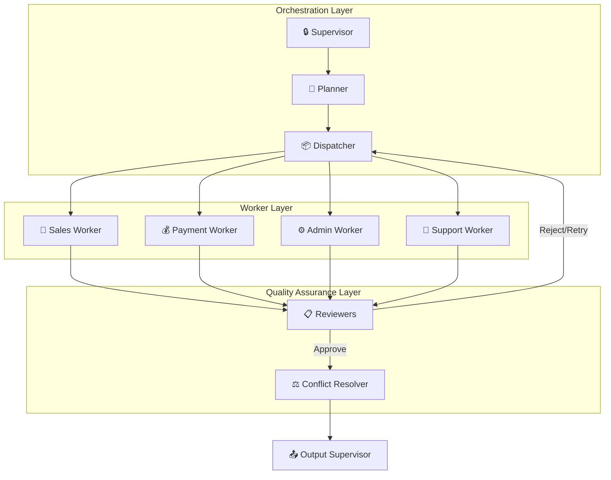

# 🤖 Ashandy AI Agent (Project Awéléwà)
### *Production-Grade Conversational Commerce System*

  

**Winner of the Meta AI Developer Academy Hackathon 2025 (Loading...)**  
**Built by Team HAI (Beneficiaries of RAIN Nigeria)**

---

**Awéléwà** (Yoruba for *"Beauty has come home"*) is a sophisticated, multi-agent system designed to automate sales, logistics, and support for Nigerian MSMEs on WhatsApp and Instagram. Unlike simple chatbots, it features a **Supervisor-Planner-Dispatcher** architecture powered by **Meta Llama 4**, utilizing **Model Context Protocol (MCP)** for autonomous tool execution.

## 📊 System Stats at a Glance
| Metric | Count | Details |
| :--- | :---: | :--- |
| **Total Autonomous Agents** | **8** | Supervisor, Planner, 4 Workers, Reviewer, Conflict Resolver |
| **Active Tools** | **48** | Integrated across all workers with validation rules |
| **Micro-Services** | **20** | Including checkpointer_service for state persistence |
| **Tool Servers (MCP)** | **4** | POS, Payment, Knowledge, Logistics |
| **Safety Layers** | **8** | Including Llama Guard, Rate Limits, & Reviewers |

---

## 🏗️ System Architecture V2.2



## 🧠 The Agent Hierarchy & Power Sources

| Agent | Role | Power Source (MCP) |
|-------|------|-------------------|
| 🔒 **Supervisor** | Gatekeeper - Safety, cache, admin detection | Llama Guard, Redis |
| 🧠 **Planner** | Chain-of-Thought task decomposition | LLM reasoning |
| 📦 **Dispatcher** | Routes tasks to workers | State machine |
| 💄 **Sales Worker** | Product search, stock, upselling | 🛒 POS, 📚 Knowledge, 🎨 DINOv2 |
| 💰 **Payment Worker** | Payment links, orders, delivery fees | 💳 Payment, 🚚 Logistics, 🛒 POS |
| ⚙️ **Admin Worker** | Reports, approvals, manual payments, order search | 🛒 POS, 📚 Knowledge, 📡 Meta API, 📱 SMS |
| 💬 **Support Worker** | Tickets, STAR logging, manager relay, resolution | 🛒 POS, 📡 Meta API, 📊 PostgreSQL |
| 📋 **Reviewer** | Anti-hallucination validation | 📖 Tool Knowledge Registry (26 tools) |
| ⚖️ **Conflict Resolver** | Synthesizes multi-worker outputs | Priority: Payment > Support > Sales |

---

## 🔌 MCP Server Architecture

| Server | Responsibilities | Tools Exposed |
|--------|------------------|---------------|
| 🛒 **POS** | PHP POS Integration | `search_products`, `check_stock`, `create_order` |
| 💳 **Payment** | Paystack Integration | `create_payment_link`, `verify_payment` |
| 📚 **Knowledge** | Pinecone / Memory | `search_memory`, `save_memory`, `delete_memory` |
| 🚚 **Logistics** | Geofencing & Pricing | `calculate_delivery_fee`, `validate_address` |

---

## 🚀 Key Features
### 🛒 Conversational Commerce & Visual Search
* **Llama 4 Vision:** Users upload images; the system uses **Meta SAM + DINOv2** embeddings to find the exact product in the inventory.

* **Cross-Platform:** Works seamlessly on **WhatsApp** and **Instagram** via Meta Graph API.

* **Federated Inventory:** "Ghost Stock" prevention; syncs Instagram posts to physical POS instantly.

## 📦 Intelligent Logistics (Agentic Workflow)
**Geofenced Pricing:** The Logistics MCP server calculates delivery fees based on dynamic Ibadan zones.
* **Zone A (Inward Bodija):** ₦1,500
* **Zone B (Bodija - Alakia):** ₦2,000
* **Zone C (Outskirts):** ₦3,000


* **Automated Dispatch:** Sends SMS to riders via Twilio upon payment confirmation.

## 🛡️ Security & Compliance (NDPR)
* **7-Layer Defense:** Includes Rate Limiting (60/min), HMAC Signature verification, and Prompt Injection shields.
* **Privacy First:** `/delete_memory` endpoint allows users to erase their semantic data (Right to be Forgotten).
* **Llama Guard:** Filters toxic inputs and outputs.

## ⚡ Performance Optimizations
* **Semantic Caching:** Redis hash-based lookup reduces LLM calls by **50%**.
* **State Persistence:** Checkpointer service with Redis Stack → Postgres → Memory fallback chain.
* **LLM Failover:** Primary: **Meta Llama 4** → Fallback: **OpenRouter**.
* **Circuit Breakers:** Graceful degradation if external APIs (Paystack/Meta) fail.

---

## 🛠️ Technology Stack
* **Orchestration:** LangGraph + LangChain
* **Backend:** Python FastAPI
* **LLM Inference:** Meta Llama 4 (70B/8B)
* **Database:**
  * **Vector:** Pinecone (Semantic Memory)
  * **Cache:** Redis Stack (State Persistence + RediSearch)
  * **Relational:** PostgreSQL (Orders & Logs)


* **Integrations:** Meta Graph API, Paystack, PHPPOS, Twilio, TomTom

---

## 📂 Project Structure
```text
ashandy-agent/
├── app/
│   ├── agents/                 # The 8 Autonomous Agents
│   │   ├── supervisor_agent.py
│   │   ├── planner_agent.py
│   │   ├── sales_worker.py...
│   ├── graphs/                 # LangGraph Workflow Definitions
│   ├── services/               # 19 Business Logic Services
│   ├── tools/                  # 20 Production Tools (5 deprecated removed)
│   └── routers/                # FastAPI Webhooks
├── mcp-servers/                # The 4 Micro-service Servers
│   ├── pos-server/
│   ├── payment-server/
│   ├── knowledge-server/
│   └── logistics-server/
└── deployment/                 # Docker & Render Configs

```

## ⚡ Quick Start

### 1. Start Infrastructure (Docker)
```bash
# Start Postgres + Redis Stack
docker-compose up -d
```

### 2. Start the Backend
```bash
# Activate environment
conda activate meta_ai

# Run FastAPI with Hot Reload
uvicorn app.main:app --reload --port 8000
```

### 2. Start MCP Servers*Run these in separate terminals:*

```bash
python mcp-servers/pos-server/ashandy_pos_server.py
python mcp-servers/payment-server/ashandy_payment_server.py

```

### 3. Test the API
```bash
curl -X POST http://localhost:8000/api/test/message \
  -H "Content-Type: application/json" \
  -d '{"user_id": "test", "message": "Show me lipsticks under 5k"}'

```

---

## 👥 Team HAI
* **Hamza Muhammad:** Technical Lead 
* **Israel Ayeni:** Product Manager 
* **Ibrahim Abdulwahab:** Growth Lead

**License:** MIT | **Documentation:** `/docs` endpoint

```