# 🤖 Ashandy AI Agent (Project Awéléwà)
### *Production-Grade Conversational Commerce System*

  

**Winner of the Meta AI Developer Academy Hackathon 2025 (Loading...)**
**Built by Team HAI (Beneficiaries of RAIN Nigeria)**

---

**Awéléwà** (Yoruba for *"Beauty has come home"*) is a sophisticated, multi-agent system designed to automate sales, logistics, and support for Nigerian MSMEs on WhatsApp and Instagram. Unlike simple chatbots, it features a **Supervisor-Planner-Dispatcher** architecture powered by **Meta Llama 4**, utilizing **Model Context Protocol (MCP)** for autonomous tool execution.

## 📊 System Stats at a Glance
| Metric | Count | Details |
| :--- | :---: | :--- |
| **Total Autonomous Agents** | **9** | Supervisor, Planner, Dispatcher, 4 Workers, Reviewers, Resolver |
| **Micro-Services** | **19** | Business logic modules |
| **Tool Servers (MCP)** | **4** | POS, Payment, Knowledge, Logistics |
| **Safety Layers** | **7** | Including Llama Guard, Rate Limits, & Reviewers |

---

## 🏗️ System Architecture V2.0

The system utilizes a **Hierarchical State Graph** architecture. Requests are not just answered; they are Planned, Dispatched, Executed, Reviewed, and Resolved.

```mermaid
graph TB
    subgraph "Orchestration Layer"
        SUP[🔒 Supervisor] --> PLN[🧠 Planner]
        PLN --> DIS[📦 Dispatcher]
    end
    
    subgraph "Worker Layer"
        DIS --> SW[💄 Sales Worker]
        DIS --> PW[💰 Payment Worker]
        DIS --> AW[⚙️ Admin Worker]
        DIS --> SPW[💬 Support Worker]
    end
    
    subgraph "Quality Assurance Layer"
        SW & PW & AW & SPW --> REV[📋 Reviewers]
        REV -- "Reject/Retry" --> DIS
        REV -- "Approve" --> CR[⚖️ Conflict Resolver]
    end
    
    CR --> OS[📤 Output Supervisor]

```



## 🧠 The Agent Hierarchy

1. **🔒 Supervisor:** The Gatekeeper. Handles Llama Guard safety checks, cache lookups (Redis), and Admin detection.

2. **🧠 Planner:** Uses **Chain-of-Thought** reasoning to decompose complex user requests into a dependency map.

3. **📦 Dispatcher:** Routes tasks to the correct specialized worker.

4. **💼 The Workers:**
* **Sales Worker:** Product search, stock checks, upselling.
* **Payment Worker:** Generates Paystack links, tracks orders.
* **Admin Worker:** Generates weekly reports, syncs inventory.
* **Support Worker:** Handles complaints and ticket escalation.


5. **📋 Reviewers:** A specialized critic loop that validates worker output against tool evidence (prevents hallucinations).

6. **⚖️ Conflict Resolver:** Synthesizes outputs from multiple workers into one coherent response.

---

## 🔌 MCP Server Architecture (Model Context Protocol)
* We utilize the **Model Context Protocol (MCP)** to decouple our LLM agents from our backend tools. 
* We run 4 distinct FastMCP Servers:

| Server | Port | Responsibilities | Tools Exposed |
| --- | --- | --- | --- |
| **🛒 POS Server** | `5001` | PHP POS Integration | `search_products`, `check_stock`, `create_order` |
| **💳 Payment Server** | `5002` | Paystack Integration | `create_payment_link`, `verify_payment` |
| **📚 Knowledge Server** | `5003` | Pinecone / Memory | `search_memory`, `save_memory`, `delete_memory` |
| **🚚 Logistics Server** | `5004` | Geofencing & Pricing | `calculate_delivery_fee`, `validate_address` |

---

## 🚀 Key Features
### 🛒 Conversational Commerce & Visual Search
* **Llama 4 Vision:** Users upload images; the system uses **Meta SAM + DINOv2** embeddings to find the exact product in the inventory.

* **Cross-Platform:** Works seamlessly on **WhatsApp** and **Instagram** via Meta Graph API.

* **Federated Inventory:** "Ghost Stock" prevention; syncs Instagram posts to physical POS instantly.

## 📦 Intelligent Logistics (Agentic Workflow)
**Geofenced Pricing:** The Logistics MCP server calculates delivery fees based on dynamic Ibadan zones.
* **Zone A (Inward Bodija):** ₦1,500
* **Zone B (Bodija - Alakia):** ₦2,000
* **Zone C (Outskirts):** ₦3,000


* **Automated Dispatch:** Sends SMS to riders via Twilio upon payment confirmation.

## 🛡️ Security & Compliance (NDPR)
* **7-Layer Defense:** Includes Rate Limiting (60/min), HMAC Signature verification, and Prompt Injection shields.
* **Privacy First:** `/delete_memory` endpoint allows users to erase their semantic data (Right to be Forgotten).
* **Llama Guard:** Filters toxic inputs and outputs.

## ⚡ Performance Optimizations
* **Semantic Caching:** Redis hash-based lookup reduces LLM calls by **50%**.
* **LLM Failover:** Primary: **Meta Llama 4** → Fallback: **OpenRouter**.
* **Circuit Breakers:** Graceful degradation if external APIs (Paystack/Meta) fail.

---

## 🛠️ Technology Stack
* **Orchestration:** LangGraph + LangChain
* **Backend:** Python FastAPI
* **LLM Inference:** Meta Llama 4 (70B/8B)
* **Database:**
* **Vector:** Pinecone (Semantic Memory)
* **Cache:** Redis (State & Semantics)
* **Relational:** PostgreSQL (Orders & Logs)


* **Integrations:** Meta Graph API, Paystack, PHPPOS, Twilio, TomTom

---

## 📂 Project Structure
```text
ashandy-agent/
├── app/
│   ├── agents/                 # The 9 Autonomous Agents
│   │   ├── supervisor_agent.py
│   │   ├── planner_agent.py
│   │   ├── sales_worker.py...
│   ├── graphs/                 # LangGraph Workflow Definitions
│   ├── services/               # 19 Business Logic Services
│   ├── tools/                  # 19 LangChain Tools
│   └── routers/                # FastAPI Webhooks
├── mcp-servers/                # The 4 Micro-service Servers
│   ├── pos-server/
│   ├── payment-server/
│   ├── knowledge-server/
│   └── logistics-server/
└── deployment/                 # Docker & Render Configs

```

## ⚡ Quick Start
### 1. Start the Backend
```bash
# Activate environment
conda activate meta_ai

# Run FastAPI with Hot Reload
uvicorn app.main:app --reload --port 8000

```

### 2. Start MCP Servers*Run these in separate terminals:*

```bash
python mcp-servers/pos-server/ashandy_pos_server.py
python mcp-servers/payment-server/ashandy_payment_server.py

```

### 3. Test the API
```bash
curl -X POST http://localhost:8000/api/test/message \
  -H "Content-Type: application/json" \
  -d '{"user_id": "test", "message": "Show me lipsticks under 5k"}'

```

---

## 👥 Team HAI
* **Hamza Muhammad:** Technical Lead 
* **Israel Ayeni:** Product Manager 
* **Ibrahim Abdulwahab:** Growth Lead

**License:** MIT | **Documentation:** `/docs` endpoint

```