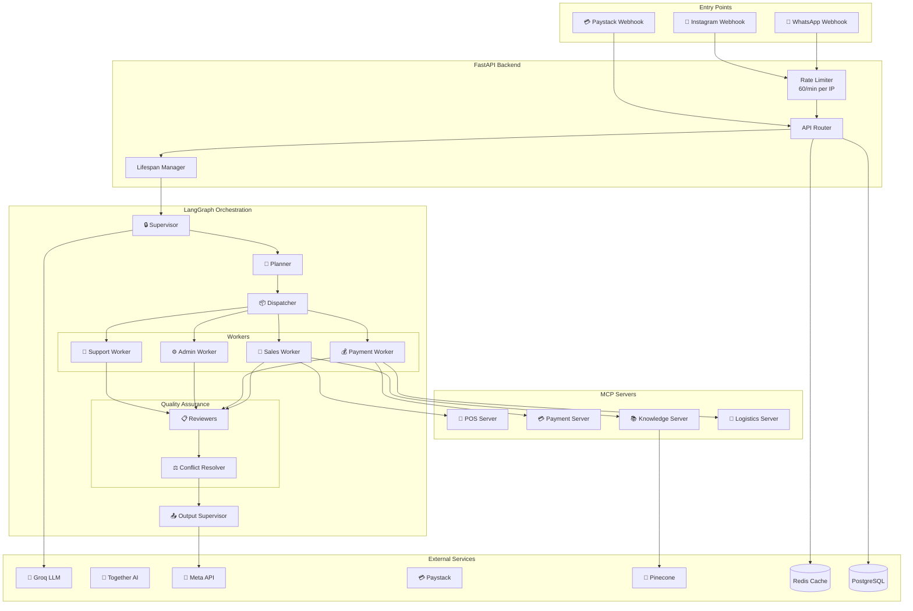
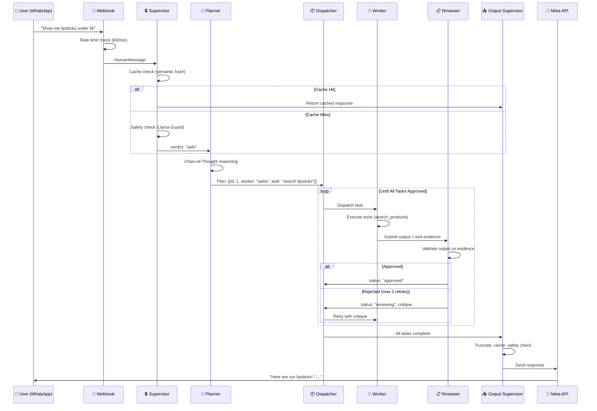
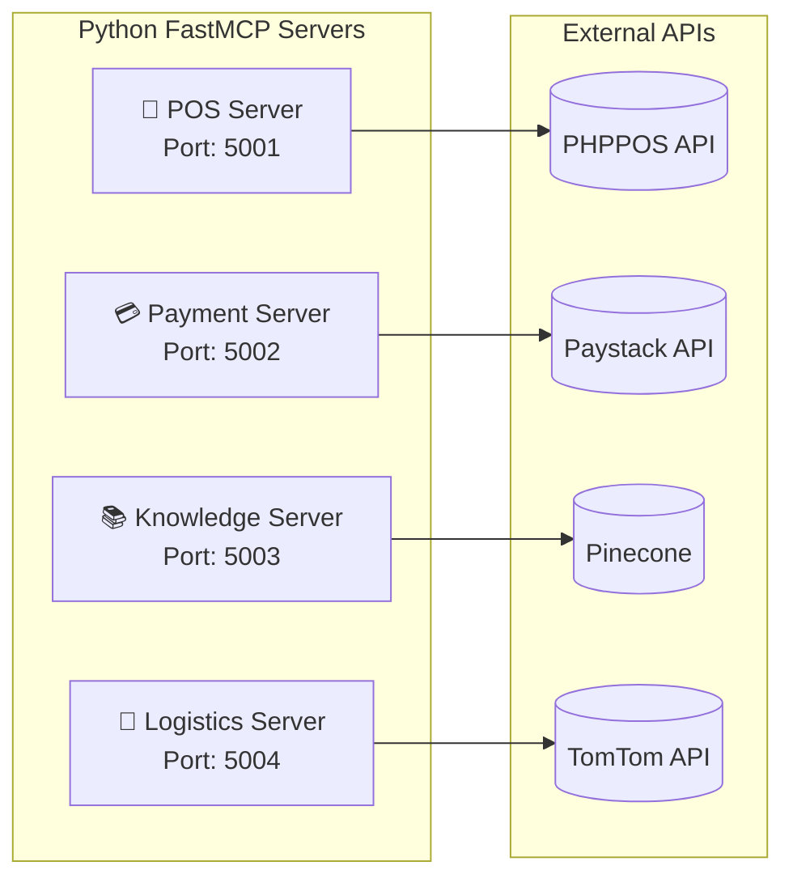

# Ashandy AI Agent - Complete System Documentation

> **Version:** 2.4 • **Last Updated:** December 20, 2025  
> **Author:** Team HAI

---

## Table of Contents

1. [Executive Summary](#1-executive-summary)
2. [System Architecture](#2-system-architecture)
3. [Agent Hierarchy](#3-agent-hierarchy)
4. [MCP Server Architecture](#4-mcp-server-architecture)
5. [Communication Patterns](#5-communication-patterns)
6. [State Management](#6-state-management)
7. [Features & Capabilities](#7-features--capabilities)
8. [Security Framework](#8-security-framework)
9. [Optimizations](#9-optimizations)
10. [Database Schema](#10-database-schema)
11. [API Endpoints](#11-api-endpoints)
12. [Configuration](#12-configuration)
13. [Deployment](#13-deployment)
14. [Directory Structure](#14-directory-structure)

---

## 1. Executive Summary

**Ashandy AI Agent** is a production-grade, multi-agent conversational commerce system for a Nigerian cosmetics store operating via WhatsApp and Instagram.

### Core Technology Stack

| Layer | Technology |
|-------|------------|
| **Framework** | FastAPI + LangGraph |
| **LLM Providers** | Groq (primary), Together AI, OpenRouter (fallbacks) |
| **Tool Protocol** | MCP (Model Context Protocol) |
| **Database** | PostgreSQL + Redis + Pinecone |
| **Messaging** | Meta Graph API (WhatsApp/Instagram) |
| **Payments** | Paystack |

### Key Metrics

| Metric | Value |
|--------|-------|
| Total Agents | 8 |
| Total Services | 20 |
| Total Tools | 48 (active, production-ready) |
| MCP Servers | 4 |
| Overall Score | 92/100 |

---

## 2. System Architecture

### 2.1 High-Level Architecture Diagram



### 2.2 Request Flow Diagram



---

## 3. Agent Hierarchy

### 3.1 Agent Overview

```
┌─────────────────────────────────────────────────────────────┐
│                    🔒 SUPERVISOR AGENT                       │
│  • Input safety (Llama Guard)                               │
│  • Off-topic filter (keyword-based)                         │
│  • Cache lookup (semantic similarity)                       │
│  • Admin detection                                          │
│  • Verdict: safe | block | ignore | cached                  │
└─────────────────────────────────────────────────────────────┘
                              │
                              ▼
┌─────────────────────────────────────────────────────────────┐
│                     🧠 PLANNER AGENT                         │
│  • Chain-of-Thought reasoning                               │
│  • Task decomposition                                       │
│  • Dependency mapping                                       │
│  • Output: [{id, worker, task, deps}...]                    │
└─────────────────────────────────────────────────────────────┘
                              │
                              ▼
┌─────────────────────────────────────────────────────────────┐
│                     📦 DISPATCHER                            │
│  • Routes tasks to workers based on type & dependencies     │
│  • Ensures one worker type active per turn                  │
│  • Tracks task statuses                                     │
└─────────────────────────────────────────────────────────────┘
                              │
        ┌─────────────────────┼─────────────────────┬─────────────────────┐
        ▼                     ▼                     ▼                     ▼
┌───────────────┐   ┌───────────────┐   ┌───────────────┐   ┌───────────────┐
│ 💄 SALES      │   │ 💰 PAYMENT    │   │ ⚙️ ADMIN      │   │ 💬 SUPPORT    │
│   WORKER      │   │   WORKER      │   │   WORKER      │   │   WORKER      │
│               │   │               │   │               │   │               │
│ • Products    │   │ • Delivery    │   │ • Reports     │   │ • Complaints  │
│ • Prices      │   │ • Payments    │   │ • Approvals   │   │ • Tickets     │
│ • Stock       │   │ • Orders      │   │ • Broadcast   │   │ • Escalation  │
│ • Upselling   │   │ • Confirmations│  │ • Inventory   │   │ • Empathy     │
└───────────────┘   └───────────────┘   └───────────────┘   └───────────────┘
        │                     │                     │                     │
        └─────────────────────┴─────────────────────┴─────────────────────┘
                                        │
┌───────────────────────────────────────────────────────────┐
│                    📋 REVIEWER AGENTS                       │
│  • Scoped per worker type (sales, payment, admin, support) │
│  • Validates output against tool evidence                  │
│  • Max 2 retries before approval                           │
│  • Allows similar product recommendations                  │
└───────────────────────────────────────────────────────────┘
                              │
                              ▼
┌─────────────────────────────────────────────────────────────┐
│                   ⚖️ CONFLICT RESOLVER                       │
│  • Detects contradictions between worker outputs           │
│  • Synthesizes coherent response                           │
│  • Priority: Payment > Support > Sales                     │
└─────────────────────────────────────────────────────────────┘
                              │
                              ▼
┌─────────────────────────────────────────────────────────────┐
│                   📤 OUTPUT SUPERVISOR                       │
│  • Truncates to 400 chars (WhatsApp limit)                 │
│  • Caches response (semantic key)                          │
│  • Blocks stack traces                                     │
│  • Safety check (Llama Guard output)                       │
│  • Logs to database                                        │
└─────────────────────────────────────────────────────────────┘
```

### 3.2 Agent Files Reference

| Agent | File | Lines |
|-------|------|-------|
| Supervisor | `app/agents/supervisor_agent.py` | ~328 |
| Planner | `app/agents/planner_agent.py` | ~223 |
| Sales Worker | `app/agents/sales_worker.py` | ~465 |
| Payment Worker | `app/agents/payment_worker.py` | ~288 (updated v2.3) |
| Admin Worker | `app/agents/admin_worker.py` | ~264 (updated v2.3) |
| Support Worker | `app/agents/support_worker.py` | ~288 (updated v2.4) |
| Reviewer | `app/agents/reviewer_agent.py` | ~164 |
| Conflict Resolver | `app/agents/conflict_resolver_agent.py` | ~80 |

### 3.3 Tool Output Formatting

All customer-facing workers (Sales, Support, Payment) format tool output through a second LLM call to ensure conversational, on-brand responses:

```
Tool Raw Output → Formatting LLM → Customer-Friendly Response
```

**Example:**
```
Before: "NIVEA SUNSCREEN (Price: 18000, Source: phppos_export)"
After:  "I found the perfect match! 💕 The *NIVEA SUNSCREEN* at ₦18,000 gives amazing protection! ✨"
```

**Formatting Prompt Pattern:**
```python
formatting_prompt = f\"\"\"You ARE Awéléwà, the friendly AI sales assistant...
PRODUCT DATA (use this to respond): {tool_output}
RESPOND DIRECTLY TO THE CUSTOMER. Do NOT include meta-text.
NOW RESPOND AS AWÉLÉWÀ:\"\"\"
```

### 3.4 Purchase Confirmation Flow

When user confirms a purchase (e.g., "I'll take the serum"), the system recognizes this as a purchase confirmation and routes directly to payment:

**Planner Recognition:**
```
"I'll take the X" / "Yes, give me X" / "Add X to cart"
→ Intent: CONFIRM_PURCHASE
→ Route to: payment_worker (NOT sales_worker)
```

**Reviewer Exception:**
- Purchase confirmation flows don't require fresh tool evidence
- "To complete your order, please provide..." → APPROVE

### 3.5 Intent Detection Keywords

```python
purchase_keywords = {
    'buy', 'order', 'want', 'get', 'purchase', 'pay', 'checkout',
    'take', 'give me', "i'll take", 'add to', 'yes', 'reserve', 'proceed'
}
```

### 3.6 Agent Power Sources (MCP Connections)

Each worker agent draws its capabilities from one or more MCP servers:

```
┌────────────────────────────────────────────────────────────────────────┐
│                        AGENT POWER SOURCE MAP                          │
├────────────────────────────────────────────────────────────────────────┤
│  💄 SALES WORKER                                                       │
│  └─► 🛒 POS Server      │ search_products, check_product_stock        │
│  └─► 📚 Knowledge Server │ retrieve_user_memory, save_user_interaction │
│  └─► 🎨 DINOv2 API      │ detect_product_from_image, visual search    │
├────────────────────────────────────────────────────────────────────────┤
│  💰 PAYMENT WORKER                                                     │
│  └─► 💳 Payment Server  │ generate_payment_link, verify_payment       │
│  └─► 🚚 Logistics Server│ calculate_delivery_fee, geocode_address     │
│  └─► 🛒 POS Server      │ create_order_record                         │
├────────────────────────────────────────────────────────────────────────┤
│  ⚙️ ADMIN WORKER                                                       │
│  └─► 🛒 POS Server      │ inventory sync, approval lists              │
│  └─► 📚 Knowledge Server│ customer profiles, lead scoring             │
│  └─► 📡 Meta API        │ relay_message_to_customer                   │
├────────────────────────────────────────────────────────────────────────┤
│ 💬 SUPPORT WORKER                                                     │
│  └─► 🛒 POS Server      │ lookup_order_history                        │
│  └─► 📡 Meta API        │ relay_to_manager, escalate_to_manager       │
│  └─► 📊 PostgreSQL      │ create_support_ticket, update_incident_star │
│                         │ confirm_customer_resolution                 │
├────────────────────────────────────────────────────────────────────────┤
│  📋 REVIEWER AGENT                                                     │
│  └─► 📖 Tool Knowledge   │ Validation rules from tool_knowledge.py    │
│      Registry            │ 50+ tools with expected outputs defined    │
└────────────────────────────────────────────────────────────────────────┘
```

### 3.7 Tool Knowledge Registry (Reviewer Enhancement)

The Reviewer Agent uses a **Tool Knowledge Registry** (`app/utils/tool_knowledge.py`) to validate worker outputs accurately.

#### Registry Structure

```python
TOOL_KNOWLEDGE = {
    "tool_name": {
        "worker": "worker_type",
        "purpose": "What the tool does",
        "expected_output": "What success looks like",
        "success_indicators": ["keyword1", "keyword2"],
        "failure_modes": {
            "Error type": "How to fix it"
        },
        "validation_rules": ["Rule 1", "Rule 2"]
    }
}
```

#### Tool Counts by Worker

| Worker | Tool Count | Examples |
|--------|------------|----------|
| Sales | 12 | search_products, detect_product_from_image, search_text_products, cart_tools (5) |
| Payment | 14 | calculate_delivery_fee, generate_payment_link, verify_payment, notify_manager, manual_payment_tools (3) |
| Support | 6 | lookup_order_history, create_support_ticket, escalate_to_manager, update_incident_star, relay_to_manager, confirm_customer_resolution |
| Admin | 16 | generate_report, approve_order, manual_payment_tools (3), order_utilities (3), notify_manager |
| **Total** | **48** | *Active production tools (5 deprecated removed in v2.3)* |

#### Tiered Validation Rules

| Worker | Mode | Description |
|--------|------|-------------|
| Sales | STRICT | Anti-hallucination, product claims must match evidence |
| Payment | MODERATE | Validate payment URLs and delivery completeness |
| Support | EMPATHY | Focus on tone and ticket creation |
| Admin | TRUST | Minimal validation for privileged users |

#### Valid Exceptions (No Tool Evidence Required)

- Simple greetings/farewells
- Non-skincare apologetic responses ("we only handle skincare")
- Alternative suggestions that appear in tool output
- Delivery detail requests
- Order confirmations

### 3.8 Anti-Hallucination Enforcement

```
┌─────────────────────────────────────────────────────────────────┐
│                    ANTI-HALLUCINATION FLOW                      │
│                                                                 │
│  Worker calls search_products("CeraVe")                         │
│                    │                                            │
│                    ▼                                            │
│  Tool returns: "No exact match. Similar: Nivea ₦4,500"          │
│                    │                                            │
│                    ▼                                            │
│  Worker recommends Nivea → ✅ VALID (from tool output)          │
│  Worker invents "Random ₦3,000" → ❌ REJECTED (no evidence)     │
│                                                                 │
│  State Flow:                                                    │
│  worker_tool_outputs[task_id] = [{"tool": name, "output": ...}] │
│                    │                                            │
│                    ▼                                            │
│  Reviewer reads tool evidence                                   │
│  Looks up TOOL_KNOWLEDGE[tool_name]                             │
│  Validates worker output against expected indicators            │
└─────────────────────────────────────────────────────────────────┘
```

## 4. MCP Server Architecture

### 4.1 What is MCP?

**Model Context Protocol (MCP)** is a standardized protocol for LLM tool calling. Each MCP server exposes tools that agents can invoke.

### 4.2 MCP Servers



### 4.3 MCP Server Tools

#### POS Server (`mcp-servers/pos-server/`)
| Tool | Function |
|------|----------|
| `search_products` | Search inventory by name/ID |
| `check_stock` | Get stock for specific item |
| `get_product_details` | Full product info |
| `create_order` | Create sale in PHPPOS |
| `get_order` | Get sale details |

#### Payment Server (`mcp-servers/payment-server/`)
| Tool | Function |
|------|----------|
| `create_payment_link` | Generate Paystack link |
| `verify_payment` | Check payment status |
| `get_transaction` | Transaction details |

#### Knowledge Server (`mcp-servers/knowledge-server/`)
| Tool | Function |
|------|----------|
| `search_memory` | Semantic search in Pinecone |
| `save_memory` | Store user interaction |
| `delete_memory` | NDPR compliance delete |

#### Logistics Server (`mcp-servers/logistics-server/`)
| Tool | Function |
|------|----------|
| `calculate_delivery_fee` | TomTom distance-based pricing |
| `validate_address` | Address verification |

---

## 5. Communication Patterns

### 5.1 Pattern: Hierarchical with Pub/Sub Review Loop

```
Supervisor (Gatekeeper)
    │
    ▼
Planner (Strategist)
    │
    ▼
Dispatcher (Router) ◄──────────────────┐
    │                                   │
    ▼                                   │
Workers (Executors)                     │
    │                                   │
    ▼                                   │
Reviewers (Quality Check) ──────────────┘
    │                                (retry loop)
    ▼
Conflict Resolver (Arbiter)
    │
    ▼
Output Supervisor (Final Guard)
```

### 5.2 State Propagation

| Field | Flow | Merge Strategy |
|-------|------|----------------|
| `messages` | Append-only | `add_messages` |
| `supervisor_verdict` | Set once | Overwrite |
| `plan` | Set by Planner | Overwrite |
| `task_statuses` | Updated by Dispatcher/Reviewer | Merge |
| `worker_outputs` | Set by Workers | `operator.or_` |
| `error` | Set on failure | Overwrite |

---

## 6. State Management

### 6.1 AgentState Schema

```python
class AgentState(TypedDict):
    # Core Conversation
    messages: Annotated[List[BaseMessage], add_messages]
    user_id: str
    session_id: str
    platform: Literal["whatsapp", "instagram"]
    
    # Routing
    is_admin: bool
    query_type: Literal["admin", "text", "image"]
    blocked: bool
    
    # Supervisor
    supervisor_verdict: Optional[Literal["safe", "block", "ignore", "cached"]]
    
    # Memory & Cache
    user_memory: Optional[Dict]
    cached_response: Optional[str]
    query_hash: Optional[str]
    
    # Visual Search
    image_url: Optional[str]
    visual_context: Optional[Dict]
    
    # Orders
    order_intent: bool
    order: Optional[Dict]
    paystack_reference: Optional[str]
    
    # Planning & Execution
    plan: Optional[List[Dict]]
    task_statuses: Optional[Dict[str, str]]
    worker_outputs: Annotated[Dict[str, str], operator.or_]
    worker_tool_outputs: Annotated[Dict[str, List[Dict]], operator.or_]
    
    # Review
    retry_counts: Optional[Dict[str, int]]
    reviewer_critique: Optional[str]
    conflict_resolution: Optional[str]
```

### 6.2 Task Status Lifecycle

```
pending → in_progress → (reviewing ↔ in_progress) → approved/failed
```

---

## 7. Features & Capabilities

### 7.1 Customer-Facing Features

| Feature | Description | Implementation |
|---------|-------------|----------------|
| **Product Search** | Text & image search | `search_products` tool, DINOv2 embeddings |
| **Price Inquiry** | Get product prices | POS MCP server |
| **Stock Check** | Availability (no counts shown) | `check_product_stock` tool |
| **Similar Products** | Upselling when unavailable | Keyword fallback search |
| **Delivery Calculator** | Distance-based fees | TomTom API |
| **Payment Links** | Secure checkout | Paystack integration |
| **Order Tracking** | Status updates | Order table queries |
| **Conversation Memory** | Remembers preferences | Pinecone vector store |
| **Visual Search** | Image-based product lookup | Hugging Face DINOv2 |
| **Story/Post Replies** | Instagram context extraction | Meta API |

### 7.2 Admin Features

| Feature | Command | Description |
|---------|---------|-------------|
| Weekly Reports | `/report` | Sales, messages, trends |
| Stock Check | `/stock [product]` | Inventory levels |
| Broadcast | `/broadcast [msg]` | Mass messaging |
| Order Approval | Auto >25k | High-value order confirmation  |
| **Manual Payment Verification** | `confirm payment for [phone]...` | Verify bank transfers with customer notification |
| **Order Search** | `show recent orders` | View last 24-48 hours of orders |
| **Customer Lookup** | `find orders for [phone]` | Search by customer phone |
| **Order Details** | `view order [id]` | Complete order information |
| **Auto-Not ifications** | Automatic | Manager receives **WhatsApp** on successful payments with detailed order/delivery info |
| Inventory Sync | Scheduled | PHPPOS synchronization |

### 7.2.1 Version 2.3 Enhancements (December 2025)

#### Payment Worker Enhancements:
- **Auto-Manager Notifications**: Payment worker now automatically triggers `notify_manager` when payments succeed
  - Manager receives SMS with order ID, customer, items, amount, and delivery address
  - Non-blocking: payment succeeds even if notification fails
  -Logic: Triggers after `verify_payment` detects success

- **Manual Payment Fallback System**:
  - `get_manual_payment_instructions` - Provides bank transfer details when Paystack fails
  - `check_api_health` - Monitors payment API status
  - Complete fallback workflow with customer guidance

- **Order Finalization Tools**:
  - `get_order_total_with_delivery` - Complete order breakdown (cart + delivery)
  - `format_order_summary` - Customer-friendly formatting

#### Admin Worker Upgrade (9 → 16 tools):
- **Manual Payment Verification**:
  - `get_pending_manual_payments` - List awaiting verification
  - `confirm_manual_payment` - Approve with auto-notification to customer
  - `reject_manual_payment` - Reject with reason, customer notified

- **Order Management Utilities**:
  - `get_recent_orders(limit, hours)` - View recent order activity
  - `search_order_by_customer(phone)` - Customer order history
  - `view_order_details(order_id)` - Complete order details

- **Enhanced System Prompt**:
  - Added comprehensive input templates for all 16 tools
  - Format examples prevent input errors
  - Error messages include correction guidance

#### Tool Registry & Cleanup:
- **Registry Expansion**: 26 → 50+ tools documented
- **Orphaned Tools Removed** (5 files, 6.3 KB):
  - `order_extraction_tool.py` - Replaced by `order_parser.py` utility
  - `email_tools.py` - Functionality in `admin_email_alert_node`
  - `meta_tools.py` - Moved to `meta_service` layer
  - `sentiment_tool.py` - Using `sentiment_service` instead
  - `twilio_tools.py` - Duplicate of `sms_tools.py`

#### Quality Improvements:
- All 3 workers verified with zero syntax errors
- Complete tool knowledge coverage (42 active tools)
- Updated documentation (README, SYSTEM_DOCS)
- Comprehensive testing scenarios documented


### 7.2.2 Version 2.4 Enhancements (December 20, 2025)

#### Support Worker - Manager-in-Loop System (3 → 6 tools):
- **Complete Redesign**: Support worker now operates in a **manager-in-loop model** instead of autonomous resolution
- **STAR Incident Logging**:
  - `update_incident_star(incident_id, task, action, result)` - Complete STAR methodology implementation
  - Every support action now logged with Task, Action, Result for audit trails
  - Enables quality improvement through retrospective analysis
  
- **Manager Relay System**:
  - `relay_to_manager(user_id, incident_id, question, suggested_responses)` - Send queries to manager via WhatsApp
  - Used for order status queries, refund requests, and decisions
  - Manager receives structured messages with suggested response formats
  - Customer notified that manager will respond
  
- **Resolution Authority**:
  - `confirm_customer_resolution(incident_id, resolution_summary, customer_confirmed)` - Support can close simple tickets
  - Requires explicit customer confirmation ("Thanks!", "All good!")
  - Only for simple issues (tracking, status checks)
  - Refunds/damage claims remain ESCALATED until manager processes
  
- **Updated Workflow**:
  1. Empathy-first response
  2. Create ticket
  3. Log STAR immediately
  4. Relay to manager or escalate
  5. Update STAR with manager response
  6. Mark resolved if customer confirms (simple issues only)

#### Manager Notification Upgrade (SMS → WhatsApp):
- **Delivery Method Changed**: `notify_manager` now uses **WhatsApp** instead of Twilio SMS
- **Detailed Formatting**:
  ```
  🛒 *NEW ORDER NOTIFICATION*
  
  📋 *ORDER DETAILS*
  ID: #pay_abc123
  Items:
  1. Nivea Lotion x2 - ₦9,000
  2. CeraVe Cleanser x1 - ₦7,500
  Subtotal: ₦16,000
  Delivery: ₦1,500
  *Total: ₦17,500*
  
  📦 *DELIVERY DETAILS*
  Full Name: John Doe
  Phone Number: 2348012345678
  Delivery Address: 123 Main St, Ibadan
  City: Ibadan
  Email: john@example.com
  
  ✅ Payment confirmed. Ready for processing!
  ```
- **Enhanced Parameters**: Now accepts items list, subtotal, delivery_fee, city, email (optional)
- **Auto-triggered**: Still triggered by payment_worker after payment verification

#### Policy Updates:
- **Returns & Refunds Policy**: Added explicit "Manager Approval Required" section
  - All refund requests require manager review within 24 hours
  - System-wide awareness (planner, sales, support, reviewer)
  - 48-hour return window maintained
  
#### Cron Job Updates:
- **Weekly Report Schedule**: Changed from Monday 3 AM → **Sunday 2 PM (14:00)**
- **Automatic Date Range**: Now calculates Monday-Sunday range automatically
  - Example: Run on Sunday 12/21/2025 → Report covers 12/15/2025 (Mon) to 12/21/2025 (Sun)
- **Enhanced Logging**: Reports exact date range in logs

#### Tool Knowledge Updates:
- Added validation rules for 3 new support tools
- Updated `notify_manager` validation: "SMS" → "WhatsApp", removed Twilio failure mode
- Complete coverage for all 48 active tools

### 7.3 Automated Features


| Feature | Schedule | Description |
|---------|----------|-------------|
| Daily Summary | 00:00 | Pre-compute daily metrics |
| Instagram Sync | Sundays 02:00 | Sync product catalog |
| Weekly Report | Sundays 14:00 (2 PM) | Generate Monday-Sunday performance report |
| Feedback Learning | Mondays 04:00 | Update learned preferences |
| Cart Abandonment | Every 6 hours | Follow-up on unpaid orders |

---

## 8. Security Framework

### 8.1 Defense Layers

```
┌──────────────────────────────────────────────────────────┐
│ Layer 1: RATE LIMITING (60/min per IP)                   │
├──────────────────────────────────────────────────────────┤
│ Layer 2: WEBHOOK SIGNATURE (HMAC SHA512 for Paystack)    │
├──────────────────────────────────────────────────────────┤
│ Layer 3: INPUT SAFETY (Llama Guard)                      │
├──────────────────────────────────────────────────────────┤
│ Layer 4: OFF-TOPIC FILTER (Keyword-based detection)      │
├──────────────────────────────────────────────────────────┤
│ Layer 5: PROMPT SECURITY (Anti-fraud instructions)       │
├──────────────────────────────────────────────────────────┤
│ Layer 6: REVIEWER VALIDATION (Evidence-based approval)   │
├──────────────────────────────────────────────────────────┤
│ Layer 7: OUTPUT SAFETY (Block stack traces, Llama Guard) │
├──────────────────────────────────────────────────────────┤
│ Layer 8: ADMIN WHITELIST (Phone number verification)     │
└──────────────────────────────────────────────────────────┘
```

### 8.2 Anti-Fraud Protections

| Attack | Protection | Location |
|--------|------------|----------|
| Price manipulation | Tool-only pricing | sales_worker prompt |
| Payment fraud | Webhook-only confirmation | payment_worker prompt |
| Approval bypass | System-only approvals | payment_worker prompt |
| Admin spoofing | Phone whitelist | supervisor_agent |
| Prompt injection | Llama Guard | supervisor_agent |
| Stack trace leak | Regex blocking | output_supervisor |

### 8.3 NDPR Compliance

- `/delete_memory` endpoint for data erasure
- User data isolated by `user_id`
- Conversation summaries cached per session

---

## 9. Optimizations

### 9.1 Performance Optimizations

| Optimization | Impact | Implementation |
|--------------|--------|----------------|
| **Semantic Caching** | 80% reduced LLM calls | Redis hash-based lookup |
| **Conversation Summarization** | 80% token reduction | Rolling summary every 5 msgs, Redis-persisted |
| **Response Cache Warming** | Instant FAQ responses | Startup preload |
| **LLM Failover** | 99.9% availability | 3-provider chain |
| **Circuit Breaker** | Graceful degradation | 60s cooldown |
| **Graph Checkpointer** | Conversation continuity | Redis Stack → Postgres → MemorySaver fallback chain |

### 9.2 Reliability Optimizations

| Optimization | Impact | Implementation |
|--------------|--------|----------------|
| **Message Retry** | Auto-recovery | Exponential backoff (3 attempts) |
| **MCP Health Checks** | Early detection | `/health/mcp` endpoint |
| **Key Rotation** | Security compliance | `/health/keys` monitoring |

### 9.3 Cost Optimizations

| Optimization | Savings | Implementation |
|--------------|---------|----------------|
| Groq (fast, cheap) | ~70% vs GPT-4 | Primary provider |
| Summarization | ~80% tokens | Rolling context |
| Caching | ~50% LLM calls | Semantic hash cache |

---

## 10. Database Schema

### 10.1 Core Tables

```sql
-- Users
users (user_id, platform_id, platform_source, full_name, role)

-- Products
products (product_id, phppos_item_id, name, price, category, image_url)

-- Orders
orders (order_id, user_id, paystack_reference, total_amount, status, metadata)

-- Customer Profiles
customer_profiles (
    user_id, total_purchases, order_count, avg_sentiment, 
    message_count, lead_score, preferred_categories
)

-- Message Logs
message_logs (id, user_id, role, content, sentiment_score, intent, platform)

-- Daily Summaries
daily_summaries (date, total_orders, total_revenue, unique_users)

-- Feedback Logs
feedback_logs (id, user_id, feedback_type, feedback_signal, context_topic)

-- Learned Preferences
learned_preferences (id, preference_type, preference_key, preference_data)
```

### 10.2 Key Indexes

```sql
idx_message_logs_user (user_id)
idx_message_logs_created (created_at)
idx_incidents_status (status)
idx_feedback_type (feedback_type)
```

---

## 11. API Endpoints

### 11.1 Webhooks

| Endpoint | Method | Purpose |
|----------|--------|---------|
| `/webhook/whatsapp` | GET | Meta verification |
| `/webhook/whatsapp` | POST | Receive messages |
| `/webhook/instagram` | GET/POST | Instagram DMs |
| `/webhook/paystack` | POST | Payment events |

### 11.2 Health & Monitoring

| Endpoint | Method | Purpose |
|----------|--------|---------|
| `/health` | GET | Service status |
| `/health/mcp` | GET | MCP server connections |
| `/health/keys` | GET | API key rotation status |

### 11.3 Documentation

| Endpoint | Method | Purpose |
|----------|--------|---------|
| `/docs` | GET | Swagger UI |
| `/redoc` | GET | ReDoc |

---

## 12. Configuration

### 12.1 Environment Variables

```env
# LLM Providers
GROQ_API_KEY=...
TOGETHER_API_KEY=...
OPENROUTER_API_KEY=...

# Meta APIs
META_WHATSAPP_TOKEN=...
META_WHATSAPP_PHONE_NUMBER_ID=...
META_VERIFY_TOKEN=...
META_INSTAGRAM_TOKEN=...

# Database
DATABASE_URL=postgresql://...
REDIS_URL=redis://...
PINECONE_API_KEY=...
PINECONE_INDEX_USER_MEMORY=...

# Payments
PAYSTACK_SECRET_KEY=...

# POS Integration
PHPPOS_BASE_URL=...
POS_CONNECTOR_API_KEY=...

# Admin
ADMIN_PHONE_NUMBERS=+234...

# Environment
ENVIRONMENT=production|development
```

### 12.2 Config Classes

```python
BaseConfig          # Shared settings
DevelopmentConfig   # Debug, verbose logging
StagingConfig       # Production-like testing
ProductionConfig    # Optimized for production
```

---

## 13. Deployment

### 13.1 Start Command

```bash
uvicorn app.main:app --reload --port 8000
```

### 13.2 Docker (Local Development)

```bash
# Start Postgres + Redis Stack
docker-compose up -d

# Then start the app
uvicorn app.main:app --reload
```

### 13.3 Render.com

Configured via `deployment/render.yaml`

---

## 14. Directory Structure

```
ashandy-agent/
├── app/
│   ├── main.py                 # FastAPI entry point
│   ├── agents/                 # 8 agent files
│   │   ├── supervisor_agent.py
│   │   ├── planner_agent.py
│   │   ├── sales_worker.py
│   │   ├── payment_worker.py
│   │   ├── admin_worker.py
│   │   ├── support_worker.py
│   │   ├── reviewer_agent.py
│   │   └── conflict_resolver_agent.py
│   ├── graphs/                 # LangGraph workflow
│   │   └── main_graph.py
│   ├── state/                  # State schema
│   │   └── agent_state.py
│   ├── services/               # 19 business services
│   │   ├── llm_service.py
│   │   ├── mcp_service.py
│   │   ├── meta_service.py
│   │   ├── profile_service.py
│   │   └── ...
│   ├── tools/                  # 19 LangChain tools
│   │   ├── product_tools.py
│   │   ├── payment_tools.py
│   │   ├── visual_tools.py
│   │   └── ...
│   ├── routers/                # API endpoints
│   │   ├── webhooks.py
│   │   ├── health.py
│   │   └── ...
│   ├── scheduler/              # Cron jobs
│   │   └── cron_tasks.py
│   └── utils/                  # Utilities
│       ├── config.py
│       └── structured_logging.py
├── mcp-servers/                # 4 MCP tool servers
│   ├── pos-server/
│   ├── payment-server/
│   ├── knowledge-server/
│   └── logistics-server/
├── docs/                       # Documentation
│   ├── api_spec.md
│   ├── db_schema.sql
│   └── policies/
├── deployment/                 # Deploy configs
│   ├── Dockerfile
│   ├── docker-compose.yml
│   └── render.yaml
├── mocks/                      # Test data
│   └── products.json
└── .env                        # Environment config
```

---

## Quick Reference

### Starting the System

```bash
# 1. Activate environment
conda activate meta_ai

# 2. Start main app
uvicorn app.main:app --reload

# 3. Start MCP servers (separate terminals)
cd mcp-servers/pos-server && python ashandy_pos_server.py
cd mcp-servers/payment-server && python ashandy_payment_server.py
cd mcp-servers/knowledge-server && python ashandy_knowledge_server.py
cd mcp-servers/logistics-server && python ashandy_logistics_server.py
```

### Testing

```bash
# Test via API
curl -X POST http://localhost:8000/api/test/message \
  -H "Content-Type: application/json" \
  -d '{"user_id": "test", "message": "show me lipsticks"}'
```

### Health Checks

```bash
curl http://localhost:8000/health
curl http://localhost:8000/health/mcp
curl http://localhost:8000/health/keys
```

---

> **End of Documentation**  
> For updates, see `/docs/` folder or `/docs` endpoint.
