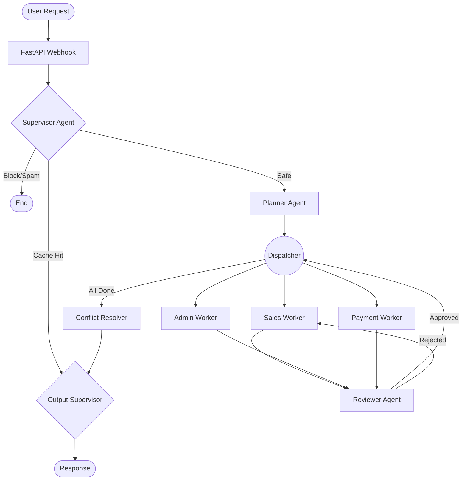

# Ashandy Agent: Agentic Workflow & Architecture Documentation

## 1. Executive Summary
The Ashandy Agent ("Awelewa") is a sophisticated, multi-agent AI system designed to automate customer service, sales, and operational tasks for Ashandy Cosmetics. It leverages a **Hierarchical Agentic Workflow** orchestrated by **LangGraph**, utilizing distinct agents for planning, execution, and review. The system integrates with **Model Context Protocol (MCP)** servers for specialized capabilities and connects to external platforms (WhatsApp, Instagram, Paystack) via FastAPI webhooks.

## 2. Architecture Overview

### High-Level Design
The system follows a **Supervisor-Worker** pattern with a **Planner** for complex task decomposition.

## 3. Core Components

### 3.1 Orchestration (LangGraph)
The central nervous system is defined in `app/graphs/main_graph.py`. It uses a `StateGraph` to manage:
- **State**: `AgentState` carries messages, the execution plan, task statuses, and user context.
- **Routing**: Conditional edges (`supervisor_router`, `dispatcher_edge`) determine the flow dynamically.
- **Concurrency**: The Dispatcher can route to different workers sequentially based on the plan.

### 3.2 Agents

#### **Supervisor Agent** (The Gatekeeper)
*File: `app/agents/supervisor_agent.py`*
- **Role**: First line of defense.
- **Responsibilities**:
    - **Spam Filtering**: Rejects emoji-only or nonsensical inputs.
    - **Safety Check**: Uses `LlamaGuard` to filter unsafe content.
    - **Caching**: Checks `response_cache_service` for instant replies.
    - **Policy Enforcement**: Blocks medical consultations, redirecting to physical stores.

#### **Planner Agent** (The Strategist)
*File: `app/agents/planner_agent.py`*
- **Role**: Decomposes user requests into actionable steps.
- **Methodology**: Uses **Chain-of-Thought (CoT)** reasoning.
- **Output**: A structured JSON plan with dependencies (e.g., "Check stock" -> "Calculate delivery" -> "Generate payment link").

#### **Workers** (The Executors)
Specialized agents performing concrete actions:
- **Sales Worker (`sales_worker.py`)**: Handles product inquiries, visual analysis, and "Awelewa" persona chit-chat.
- **Admin Worker (`admin_worker.py`)**: Handles high-value order validation (>25k), reporting, and internal alerts.
- **Payment Worker (`payment_worker.py`)**: Calculates delivery fees and generates Paystack payment links.

#### **Reviewer Agent** (The Quality Control)
*File: `app/agents/reviewer_agent.py`*
- **Role**: Validates worker outputs before they are finalized.
- **Function**: Ensures policies are met (e.g., "Did the sales agent check stock before selling?").

### 3.3 Model Context Protocol (MCP)
*Service: `app/services/mcp_service.py`*
The system uses MCP to offload specialized tasks to isolated microservices.
- **Connection**: `StdioServerParameters` helps connect to local Python scripts as servers.
- **Integration**:
    - **Knowledge Server**: Used by Sales Worker (`detect_product_from_image`) for deep visual analysis.
    - **POS/Payment/Logistics Servers**: Stubbed or active for future extensibility.
- **Benefits**: Decouples complex logic (like heavy visual processing or legacy database connections) from the main agent loop.

## 4. Workflows & Methodologies

### 4.1 The Planning Loop
1. **User Intent**: "I want 5 ringlights delivered to Lekki."
2. **Planner**:
    - Step 1: Sales Worker -> Check stock for "ringlight".
    - Step 2: Payment Worker -> Calculate delivery to "Lekki".
    - Step 3: Admin Worker -> Approve order (Value > 25k).
3. **Execution**: The Dispatcher executes Step 1. If successful (and approved by Reviewer), it unlocks Step 2.

### 4.2 Interactive & Multimodal
- **Inputs**: Text (WhatsApp/IG) and Images (Visual processing).
- **Visual Flow**:
    - User sends image.
    - Webhook extracts URL.
    - `SalesWorker` calls `detect_product_from_image`.
    - Tool calls MCP `Knowledge` server.
    - Analysis returned to agent to recommend products.

### 4.3 Safety & Security
- **Input Guardrails**: Supervisor checks for PII, toxicity, and medical advice requests.
- **Output Guardrails**: Output Supervisor prevents stack trace leaks and truncates messages to fit WhatsApp limits (500 chars).
- **Transactions**: Payment links are generated only after stock confirmation and delivery calculation.

## 5. Tools & Services
- **`product_tools.py`**: Interacts with the database for product/stock info.
- **`vector_tools.py`**: RAG implementation for retrieving user history and product context.
- **`meta_tools.py`**: Wrappers for WhatsApp/Instagram APIs.
- **`llama_guard_tool.py`**: Integration with Meta's LlamaGuard for content safety.

## 6. Deployment & Entry Points
- **Entry**: `main.py` exposes `/webhook/whatsapp` and `/webhook/instagram`.
- **Server**: FastAPI handles the HTTP layer.
- **Async**: Heavy usage of `async/await` for non-blocking agent operations.
