# 🧠 Conversation Memory System - How It Works

## Overview

The Awelewa agent has a **multi-layered memory system** that provides conversation context:

1. **Short-term Memory**: LangGraph checkpointer (within session)
2. **Long-term Memory**: Pinecone vector store (across sessions)

---

## Architecture

### 1. Short-Term Memory (LangGraph MemorySaver)

**Location**: [`main_graph.py`](file:///c:/Users/USER/Desktop/AI%20projects/ashandy-agent/app/graphs/main_graph.py#L334)

```python
memory_saver = MemorySaver()
app = workflow.compile(checkpointer=memory_saver)
```

**How It Works**:
- Automatically saves conversation state between turns
- Uses `thread_id` (user's phone number) as key
- Keeps entire message history in current session
- Agent sees all previous messages in the current conversation

**Usage in Webhooks**:
```python
# webhooks.py passes thread_id
final_state = await agent_app.ainvoke(
    input_state,
    config={"configurable": {"thread_id": from_phone}}  # ← Session memory key
)
```

---

### 2. Long-Term Memory (Pinecone Vector Store)

**Location**: 
- Retrieval: [`main_graph.py` - memory_retrieval_node](file:///c:/Users/USER/Desktop/AI%20projects/ashandy-agent/app/graphs/main_graph.py#L64-L91)
- Saving: [`main_graph.py` - response_node](file:///c:/Users/USER/Desktop/AI%20projects/ashandy-agent/app/graphs/main_graph.py#L152-L173)
- Tools: [`vector_tools.py`](file:///c:/Users/USER/Desktop/AI%20projects/ashandy-agent/app/tools/vector_tools.py)

**How It Works**:
```
User sends message
  ↓
Router → Safety → Cache Check
  ↓
memory_retrieval_node ← Queries Pinecone for past interactions
  ↓
Sales Agent (gets user_memory in state)
  ↓
Creates prompt with memory context
  ↓
Generates response
  ↓
response_node → Saves interaction to Pinecone
```

**What Gets Stored**:
- Past conversations (user message + AI response pairs)
- User preferences (skin type, budget, favorite products)
- Previous purchases
- Product interests

---

## How Sales Agent Uses Memory

**File**: [`sales_consultant_agent.py`](file:///c:/Users/USER/Desktop/AI%20projects/ashandy-agent/app/agents/sales_consultant_agent.py#L31-L46)

```python
async def sales_agent_node(state: AgentState):
    # Get memory from state
    user_memory = state.get("user_memory", "")
    
    # Build memory context for prompt
    memory_info = ""
    if user_memory and user_memory != "No previous memory found.":
        memory_info = f"\n\nCustomer History:\n{user_memory}"
        logger.info(f"🧠 Using user memory in prompt: {user_memory[:80]}...")
    
    # Inject into system prompt
    system_prompt = f"""You are Awéléwà...
    
    {memory_info}  ← Memory context here
    
    ### INSTRUCTIONS
    - Use customer history to personalize responses
    - Remember their preferences and past purchases
    """
```

---

## Memory Flow Example

### Scenario: Returning Customer

**First Conversation (Yesterday)**:
```
User: "I'm looking for products for dry skin"
AI: "Great! For dry skin, I recommend our Hydrating Cream (₦5000)..."

→ Saved to Pinecone:
  user_id: +2349026880099
  memory_text: "Customer has dry skin. Interested in Hydrating Cream."
```

**Second Conversation (Today)**:
```
1. User: "Hi, do you have any new moisturizers?"

2. memory_retrieval_node:
   - Queries Pinecone for user +2349026880099
   - Retrieves: "Customer has dry skin. Interested in Hydrating Cream."
   - Sets state: user_memory = "Customer has dry skin..."

3. Sales Agent Prompt Includes:
   """
   Customer History:
   Customer has dry skin. Interested in Hydrating Cream.
   """

4. AI Response:
   "Welcome back! Since you have dry skin, you might love our NEW 
   Ultra-Hydrating Night Cream (₦6500). It's perfect for dry skin..."
```

✅ **Agent remembered the customer has dry skin!**

---

## Memory Retrieval Details

**Vector Search** ([`vector_tools.py`](file:///c:/Users/USER/Desktop/AI%20projects/ashandy-agent/app/tools/vector_tools.py#L24-L54)):

```python
@tool
async def retrieve_user_memory(user_id: str) -> str:
    # Create semantic query
    query_vector = embedding_model.encode(f"User preferences for {user_id}")
    
    # Search Pinecone
    response = vector_service.query_vectors(
        index_name=settings.PINECONE_INDEX_USER_MEMORY,
        vector=query_vector,
        top_k=3,  # Get top 3 most relevant memories
        filter_metadata={"user_id": user_id}  # Only this user's data
    )
    
    # Format for prompt
    memory_text = "\n".join([m['metadata'].get('memory_text', '') for m in matches])
    return f"User Context:\n{memory_text}"
```

---

## Memory Saving Details

**Automatic Saving** ([`main_graph.py` - response_node](file:///c:/Users/USER/Desktop/AI%20projects/ashandy-agent/app/graphs/main_graph.py#L152-L173)):

```python
async def response_node(state: AgentState):
    # ... send message to user ...
    
    # Automatically save memory after sending
    try:
        last_human = state.get("last_user_message", "")
        
        if last_human and text:
            logger.info(f"Saving interaction memory for {user_id}")
            await save_user_interaction(
                user_id=user_id,
                user_msg=last_human,
                ai_msg=text
            )
    except Exception as e:
        logger.error(f"Memory save failed: {e}")
```

**What Gets Saved** ([`vector_tools.py`](file:///c:/Users/USER/Desktop/AI%20projects/ashandy-agent/app/tools/vector_tools.py#L58-L114)):
- User message + AI response pair
- Embedded as vector for semantic search
- Tagged with `user_id` for filtering
- Stored in `PINECONE_INDEX_USER_MEMORY`

---

## Configuration

**Environment Variables** (`.env`):
```env
PINECONE_INDEX_USER_MEMORY=user-memory-awelewa
PINECONE_API_KEY=your_key_here
```

**Vector Service** ([`vector_service.py`](file:///c:/Users/USER/Desktop/AI%20projects/ashandy-agent/app/services/vector_service.py)):
- Handles Pinecone connections
- Upserts vectors
- Queries with filters

---

## Testing Memory System

### Test 1: Send First Message
```
Send via WhatsApp: "I have oily skin and looking for foundation"

Expected Logs:
🧠 Retrieving memory for user: +234xxx
ℹ️  No previous memory for +234xxx (new customer)
ℹ️  No user memory available (new/first-time customer)
Saving interaction memory for +234xxx
```

### Test 2: Send Follow-up Message (Same Session)
```
Send via WhatsApp: "What about the price?"

Expected Logs:
🧠 Retrieving memory for user: +234xxx
✅ Memory found for +234xxx: User has oily skin...
🧠 Using user memory in prompt: User has oily skin...

AI should remember context from previous message in same session!
```

### Test 3: New Session (Hours Later)
```
Send via WhatsApp: "Hi, any new products?"

Expected Logs:
🧠 Retrieving memory for user: +234xxx
✅ Memory found for +234xxx: User has oily skin. Asked about foundation...
🧠 Using user memory in prompt: User has oily skin. Asked about foundation...

AI should remember you have oily skin from previous session!
```

---

## Monitoring Memory

### Check Logs
```bash
# See memory operations
grep "🧠" logs/app.log
grep "Memory" logs/app.log
```

### Example Good Logs:
```
🧠 Retrieving memory for user: +2349026880099
✅ Memory found for +2349026880099: Customer has dry skin. Interested in Hydrating...
🧠 Using user memory in prompt: Customer has dry skin. Interested in Hydrating Cream...
Saving interaction memory for +2349026880099
```

### Example New Customer Logs:
```
🧠 Retrieving memory for user: +2341234567890
ℹ️  No previous memory for +2341234567890 (new customer)
ℹ️  No user memory available (new/first-time customer)
Saving interaction memory for +2341234567890
```

---

## Graph Flow with Memory

```mermaid
graph TD
    START[User Message] --> router[Router]
    router --> safety[Safety Check]
    safety --> cache[Cache Check]
    cache -->|Miss| memory[🧠 Memory Retrieval]
    memory --> sales[Sales Agent]
    sales -->|Uses memory in prompt| response[Generate Response]
    response --> save[💾 Save Interaction]
    save --> send[Send to User]
    send --> END
```



---

## Key Features

✅ **Automatic**: Memory retrieved and saved automatically in every conversation  
✅ **Semantic**: Uses vector embeddings for smart retrieval  
✅ **Filtered**: Only retrieves data for the specific user  
✅ **Contextualized**: Memory injected directly into agent's prompt  
✅ **Persistent**: Survives across sessions (days, weeks, months)  
✅ **Recent First**: Top-k retrieval gets most relevant memories  

---

## Troubleshooting

### Memory Not Retrieved
**Check**:
1. Pinecone index exists: `PINECONE_INDEX_USER_MEMORY`
2. API key is valid
3. Embedding model loads successfully
4. Logs show `🧠 Retrieving memory...`

### Memory Not Saved
**Check**:
1. `last_user_message` is set in state
2. AI response exists
3. No errors in `save_user_interaction`
4. Logs show `Saving interaction memory for...`

### Agent Doesn't Use Memory
**Check**:
1. Memory is retrieved (check logs)
2. Memory is not "No previous memory found."
3. Sales agent receives `user_memory` in state
4. Prompt includes `{memory_info}`

---

## Summary

Your agent **already has full conversation memory**:
- ✅ Short-term: LangGraph session memory (current conversation)
- ✅ Long-term: Pinecone vector memory (across all past conversations)
- ✅ Automatic: Retrieves before response, saves after response
- ✅ Contextual: Injected into sales agent prompt
- ✅ Logged: Enhanced logging shows when memory is used

**Just send WhatsApp messages and watch the logs!** 🚀
