# Ashandy AI Agent - Complete System Documentation

> **Version:** 2.0 • **Last Updated:** December 16, 2025  
> **Author:** Team HAI

---

## Table of Contents

1. [Executive Summary](#1-executive-summary)
2. [System Architecture](#2-system-architecture)
3. [Agent Hierarchy](#3-agent-hierarchy)
4. [MCP Server Architecture](#4-mcp-server-architecture)
5. [Communication Patterns](#5-communication-patterns)
6. [State Management](#6-state-management)
7. [Features & Capabilities](#7-features--capabilities)
8. [Security Framework](#8-security-framework)
9. [Optimizations](#9-optimizations)
10. [Database Schema](#10-database-schema)
11. [API Endpoints](#11-api-endpoints)
12. [Configuration](#12-configuration)
13. [Deployment](#13-deployment)
14. [Directory Structure](#14-directory-structure)

---

## 1. Executive Summary

**Ashandy AI Agent** is a production-grade, multi-agent conversational commerce system for a Nigerian cosmetics store operating via WhatsApp and Instagram.

### Core Technology Stack

| Layer | Technology |
|-------|------------|
| **Framework** | FastAPI + LangGraph |
| **LLM Providers** | Groq (primary), Together AI, OpenRouter (fallbacks) |
| **Tool Protocol** | MCP (Model Context Protocol) |
| **Database** | PostgreSQL + Redis + Pinecone |
| **Messaging** | Meta Graph API (WhatsApp/Instagram) |
| **Payments** | Paystack |

### Key Metrics

| Metric | Value |
|--------|-------|
| Total Agents | 9 |
| Total Services | 19 |
| Total Tools | 19 |
| MCP Servers | 4 |
| Overall Score | 88.75/100 |

---

## 2. System Architecture

### 2.1 High-Level Architecture Diagram

```mermaid
graph TB
    subgraph "Entry Points"
        WH[📱 WhatsApp Webhook]
        IG[📸 Instagram Webhook]
        PS[💳 Paystack Webhook]
    end
    
    subgraph "FastAPI Backend"
        RT[Rate Limiter<br/>60/min per IP]
        API[API Router]
        LIFE[Lifespan Manager]
    end
    
    subgraph "LangGraph Orchestration"
        SUP[🔒 Supervisor]
        PLN[🧠 Planner]
        DIS[📦 Dispatcher]
        
        subgraph "Workers"
            SW[💄 Sales Worker]
            PW[💰 Payment Worker]
            AW[⚙️ Admin Worker]
            SPW[💬 Support Worker]
        end
        
        subgraph "Quality Assurance"
            REV[📋 Reviewers]
            CR[⚖️ Conflict Resolver]
        end
        
        OS[📤 Output Supervisor]
    end
    
    subgraph "MCP Servers"
        POS[🛒 POS Server]
        PAY[💳 Payment Server]
        KNOW[📚 Knowledge Server]
        LOG[🚚 Logistics Server]
    end
    
    subgraph "External Services"
        GROQ[🤖 Groq LLM]
        TOGETHER[🤖 Together AI]
        META[📡 Meta API]
        PAYSTACK[💳 Paystack]
        PINE[🌲 Pinecone]
        REDIS[(Redis Cache)]
        PG[(PostgreSQL)]
    end
    
    WH --> RT --> API
    IG --> RT
    PS --> API
    
    API --> LIFE --> SUP
    SUP --> PLN --> DIS
    DIS --> SW & PW & AW & SPW
    SW & PW & AW & SPW --> REV
    REV --> CR --> OS --> META
    
    SW --> POS & KNOW
    PW --> PAY & LOG
    SUP --> GROQ
    KNOW --> PINE
    API --> REDIS & PG
```



### 2.2 Request Flow Diagram

```mermaid
sequenceDiagram
    participant U as 👤 User (WhatsApp)
    participant W as 📡 Webhook
    participant S as 🔒 Supervisor
    participant P as 🧠 Planner
    participant D as 📦 Dispatcher
    participant WK as 💼 Worker
    participant R as 📋 Reviewer
    participant O as 📤 Output Supervisor
    participant M as 📱 Meta API
    
    U->>W: "Show me lipsticks under 5k"
    W->>W: Rate limit check (60/min)
    W->>S: HumanMessage
    
    S->>S: Cache check (semantic hash)
    alt Cache Hit
        S->>O: Return cached response
    else Cache Miss
        S->>S: Safety check (Llama Guard)
        S->>P: verdict: "safe"
    end
    
    P->>P: Chain-of-Thought reasoning
    P->>D: Plan: [{id: 1, worker: "sales", task: "search lipsticks"}]
    
    loop Until All Tasks Approved
        D->>WK: Dispatch task
        WK->>WK: Execute tools (search_products)
        WK->>R: Submit output + tool evidence
        R->>R: Validate output vs evidence
        alt Approved
            R->>D: status: "approved"
        else Rejected (max 2 retries)
            R->>D: status: "reviewing", critique
            D->>WK: Retry with critique
        end
    end
    
    D->>O: All tasks complete
    O->>O: Truncate, cache, safety check
    O->>M: Send response
    M->>U: "Here are our lipsticks! 💄..."
```



---

## 3. Agent Hierarchy

### 3.1 Agent Overview

```
┌─────────────────────────────────────────────────────────────┐
│                    🔒 SUPERVISOR AGENT                       │
│  • Input safety (Llama Guard)                               │
│  • Cache lookup (semantic similarity)                       │
│  • Admin detection                                          │
│  • Verdict: safe | block | ignore | cached                  │
└─────────────────────────────────────────────────────────────┘
                              │
                              ▼
┌─────────────────────────────────────────────────────────────┐
│                     🧠 PLANNER AGENT                         │
│  • Chain-of-Thought reasoning                               │
│  • Task decomposition                                       │
│  • Dependency mapping                                       │
│  • Output: [{id, worker, task, deps}...]                    │
└─────────────────────────────────────────────────────────────┘
                              │
                              ▼
┌─────────────────────────────────────────────────────────────┐
│                     📦 DISPATCHER                            │
│  • Routes tasks to workers based on type & dependencies     │
│  • Ensures one worker type active per turn                  │
│  • Tracks task statuses                                     │
└─────────────────────────────────────────────────────────────┘
                              │
        ┌─────────────────────┼─────────────────────┬─────────────────────┐
        ▼                     ▼                     ▼                     ▼
┌───────────────┐   ┌───────────────┐   ┌───────────────┐   ┌───────────────┐
│ 💄 SALES      │   │ 💰 PAYMENT    │   │ ⚙️ ADMIN      │   │ 💬 SUPPORT    │
│   WORKER      │   │   WORKER      │   │   WORKER      │   │   WORKER      │
│               │   │               │   │               │   │               │
│ • Products    │   │ • Delivery    │   │ • Reports     │   │ • Complaints  │
│ • Prices      │   │ • Payments    │   │ • Approvals   │   │ • Tickets     │
│ • Stock       │   │ • Orders      │   │ • Broadcast   │   │ • Escalation  │
│ • Upselling   │   │ • Confirmations│  │ • Inventory   │   │ • Empathy     │
└───────────────┘   └───────────────┘   └───────────────┘   └───────────────┘
        │                     │                     │                     │
        └─────────────────────┴─────────────────────┴─────────────────────┘
                                        │
┌───────────────────────────────────────────────────────────┐
│                    📋 REVIEWER AGENTS                       │
│  • Scoped per worker type (sales, payment, admin, support) │
│  • Validates output against tool evidence                  │
│  • Max 2 retries before approval                           │
│  • Allows similar product recommendations                  │
└───────────────────────────────────────────────────────────┘
                              │
                              ▼
┌─────────────────────────────────────────────────────────────┐
│                   ⚖️ CONFLICT RESOLVER                       │
│  • Detects contradictions between worker outputs           │
│  • Synthesizes coherent response                           │
│  • Priority: Payment > Support > Sales                     │
└─────────────────────────────────────────────────────────────┘
                              │
                              ▼
┌─────────────────────────────────────────────────────────────┐
│                   📤 OUTPUT SUPERVISOR                       │
│  • Truncates to 400 chars (WhatsApp limit)                 │
│  • Caches response (semantic key)                          │
│  • Blocks stack traces                                     │
│  • Safety check (Llama Guard output)                       │
│  • Logs to database                                        │
└─────────────────────────────────────────────────────────────┘
```

### 3.2 Agent Files Reference

| Agent | File | Lines |
|-------|------|-------|
| Supervisor | `app/agents/supervisor_agent.py` | ~220 |
| Planner | `app/agents/planner_agent.py` | ~120 |
| Sales Worker | `app/agents/sales_worker.py` | ~170 |
| Payment Worker | `app/agents/payment_worker.py` | ~160 |
| Admin Worker | `app/agents/admin_worker.py` | ~200 |
| Support Worker | `app/agents/support_worker.py` | ~200 |
| Reviewer | `app/agents/reviewer_agent.py` | ~130 |
| Conflict Resolver | `app/agents/conflict_resolver_agent.py` | ~80 |

---

## 4. MCP Server Architecture

### 4.1 What is MCP?

**Model Context Protocol (MCP)** is a standardized protocol for LLM tool calling. Each MCP server exposes tools that agents can invoke.

### 4.2 MCP Servers

```mermaid
graph LR
    subgraph "Python FastMCP Servers"
        POS[🛒 POS Server<br/>Port: 5001]
        PAY[💳 Payment Server<br/>Port: 5002]
        KNOW[📚 Knowledge Server<br/>Port: 5003]
        LOG[🚚 Logistics Server<br/>Port: 5004]
    end
    
    subgraph "External APIs"
        PHPPOS[(PHPPOS API)]
        PAYSTACK[(Paystack API)]
        PINECONE[(Pinecone)]
        TOMTOM[(TomTom API)]
    end
    
    POS --> PHPPOS
    PAY --> PAYSTACK
    KNOW --> PINECONE
    LOG --> TOMTOM
```



### 4.3 MCP Server Tools

#### POS Server (`mcp-servers/pos-server/`)
| Tool | Function |
|------|----------|
| `search_products` | Search inventory by name/ID |
| `check_stock` | Get stock for specific item |
| `get_product_details` | Full product info |
| `create_order` | Create sale in PHPPOS |
| `get_order` | Get sale details |

#### Payment Server (`mcp-servers/payment-server/`)
| Tool | Function |
|------|----------|
| `create_payment_link` | Generate Paystack link |
| `verify_payment` | Check payment status |
| `get_transaction` | Transaction details |

#### Knowledge Server (`mcp-servers/knowledge-server/`)
| Tool | Function |
|------|----------|
| `search_memory` | Semantic search in Pinecone |
| `save_memory` | Store user interaction |
| `delete_memory` | NDPR compliance delete |

#### Logistics Server (`mcp-servers/logistics-server/`)
| Tool | Function |
|------|----------|
| `calculate_delivery_fee` | TomTom distance-based pricing |
| `validate_address` | Address verification |

---

## 5. Communication Patterns

### 5.1 Pattern: Hierarchical with Pub/Sub Review Loop

```
Supervisor (Gatekeeper)
    │
    ▼
Planner (Strategist)
    │
    ▼
Dispatcher (Router) ◄──────────────────┐
    │                                   │
    ▼                                   │
Workers (Executors)                     │
    │                                   │
    ▼                                   │
Reviewers (Quality Check) ──────────────┘
    │                                (retry loop)
    ▼
Conflict Resolver (Arbiter)
    │
    ▼
Output Supervisor (Final Guard)
```

### 5.2 State Propagation

| Field | Flow | Merge Strategy |
|-------|------|----------------|
| `messages` | Append-only | `add_messages` |
| `supervisor_verdict` | Set once | Overwrite |
| `plan` | Set by Planner | Overwrite |
| `task_statuses` | Updated by Dispatcher/Reviewer | Merge |
| `worker_outputs` | Set by Workers | `operator.or_` |
| `error` | Set on failure | Overwrite |

---

## 6. State Management

### 6.1 AgentState Schema

```python
class AgentState(TypedDict):
    # Core Conversation
    messages: Annotated[List[BaseMessage], add_messages]
    user_id: str
    session_id: str
    platform: Literal["whatsapp", "instagram"]
    
    # Routing
    is_admin: bool
    query_type: Literal["admin", "text", "image"]
    blocked: bool
    
    # Supervisor
    supervisor_verdict: Optional[Literal["safe", "block", "ignore", "cached"]]
    
    # Memory & Cache
    user_memory: Optional[Dict]
    cached_response: Optional[str]
    query_hash: Optional[str]
    
    # Visual Search
    image_url: Optional[str]
    visual_context: Optional[Dict]
    
    # Orders
    order_intent: bool
    order: Optional[Dict]
    paystack_reference: Optional[str]
    
    # Planning & Execution
    plan: Optional[List[Dict]]
    task_statuses: Optional[Dict[str, str]]
    worker_outputs: Annotated[Dict[str, str], operator.or_]
    worker_tool_outputs: Annotated[Dict[str, List[Dict]], operator.or_]
    
    # Review
    retry_counts: Optional[Dict[str, int]]
    reviewer_critique: Optional[str]
    conflict_resolution: Optional[str]
```

### 6.2 Task Status Lifecycle

```
pending → in_progress → (reviewing ↔ in_progress) → approved/failed
```

---

## 7. Features & Capabilities

### 7.1 Customer-Facing Features

| Feature | Description | Implementation |
|---------|-------------|----------------|
| **Product Search** | Text & image search | `search_products` tool, DINOv2 embeddings |
| **Price Inquiry** | Get product prices | POS MCP server |
| **Stock Check** | Availability (no counts shown) | `check_product_stock` tool |
| **Similar Products** | Upselling when unavailable | Keyword fallback search |
| **Delivery Calculator** | Distance-based fees | TomTom API |
| **Payment Links** | Secure checkout | Paystack integration |
| **Order Tracking** | Status updates | Order table queries |
| **Conversation Memory** | Remembers preferences | Pinecone vector store |
| **Visual Search** | Image-based product lookup | Hugging Face DINOv2 |
| **Story/Post Replies** | Instagram context extraction | Meta API |

### 7.2 Admin Features

| Feature | Command | Description |
|---------|---------|-------------|
| Weekly Reports | `/report` | Sales, messages, trends |
| Stock Check | `/stock [product]` | Inventory levels |
| Broadcast | `/broadcast [msg]` | Mass messaging |
| Order Approval | Auto >25k | High-value order confirmation |
| Inventory Sync | Scheduled | PHPPOS synchronization |

### 7.3 Automated Features

| Feature | Schedule | Description |
|---------|----------|-------------|
| Daily Summary | 00:00 | Pre-compute daily metrics |
| Instagram Sync | Sundays 02:00 | Sync product catalog |
| Weekly Report | Mondays 03:00 | Generate performance report |
| Feedback Learning | Mondays 04:00 | Update learned preferences |
| Cart Abandonment | Every 6 hours | Follow-up on unpaid orders |

---

## 8. Security Framework

### 8.1 Defense Layers

```
┌──────────────────────────────────────────────────────────┐
│ Layer 1: RATE LIMITING (60/min per IP)                   │
├──────────────────────────────────────────────────────────┤
│ Layer 2: WEBHOOK SIGNATURE (HMAC SHA512 for Paystack)    │
├──────────────────────────────────────────────────────────┤
│ Layer 3: INPUT SAFETY (Llama Guard)                      │
├──────────────────────────────────────────────────────────┤
│ Layer 4: PROMPT SECURITY (Anti-fraud instructions)       │
├──────────────────────────────────────────────────────────┤
│ Layer 5: REVIEWER VALIDATION (Evidence-based approval)   │
├──────────────────────────────────────────────────────────┤
│ Layer 6: OUTPUT SAFETY (Block stack traces, Llama Guard) │
├──────────────────────────────────────────────────────────┤
│ Layer 7: ADMIN WHITELIST (Phone number verification)     │
└──────────────────────────────────────────────────────────┘
```

### 8.2 Anti-Fraud Protections

| Attack | Protection | Location |
|--------|------------|----------|
| Price manipulation | Tool-only pricing | sales_worker prompt |
| Payment fraud | Webhook-only confirmation | payment_worker prompt |
| Approval bypass | System-only approvals | payment_worker prompt |
| Admin spoofing | Phone whitelist | supervisor_agent |
| Prompt injection | Llama Guard | supervisor_agent |
| Stack trace leak | Regex blocking | output_supervisor |

### 8.3 NDPR Compliance

- `/delete_memory` endpoint for data erasure
- User data isolated by `user_id`
- Conversation summaries cached per session

---

## 9. Optimizations

### 9.1 Performance Optimizations

| Optimization | Impact | Implementation |
|--------------|--------|----------------|
| **Semantic Caching** | 80% reduced LLM calls | Redis hash-based lookup |
| **Conversation Summarization** | 80% token reduction | Rolling summary every 5 msgs |
| **Response Cache Warming** | Instant FAQ responses | Startup preload |
| **LLM Failover** | 99.9% availability | 3-provider chain |
| **Circuit Breaker** | Graceful degradation | 60s cooldown |

### 9.2 Reliability Optimizations

| Optimization | Impact | Implementation |
|--------------|--------|----------------|
| **Message Retry** | Auto-recovery | Exponential backoff (3 attempts) |
| **MCP Health Checks** | Early detection | `/health/mcp` endpoint |
| **Key Rotation** | Security compliance | `/health/keys` monitoring |

### 9.3 Cost Optimizations

| Optimization | Savings | Implementation |
|--------------|---------|----------------|
| Groq (fast, cheap) | ~70% vs GPT-4 | Primary provider |
| Summarization | ~80% tokens | Rolling context |
| Caching | ~50% LLM calls | Semantic hash cache |

---

## 10. Database Schema

### 10.1 Core Tables

```sql
-- Users
users (user_id, platform_id, platform_source, full_name, role)

-- Products
products (product_id, phppos_item_id, name, price, category, image_url)

-- Orders
orders (order_id, user_id, paystack_reference, total_amount, status, metadata)

-- Customer Profiles
customer_profiles (
    user_id, total_purchases, order_count, avg_sentiment, 
    message_count, lead_score, preferred_categories
)

-- Message Logs
message_logs (id, user_id, role, content, sentiment_score, intent, platform)

-- Daily Summaries
daily_summaries (date, total_orders, total_revenue, unique_users)

-- Feedback Logs
feedback_logs (id, user_id, feedback_type, feedback_signal, context_topic)

-- Learned Preferences
learned_preferences (id, preference_type, preference_key, preference_data)
```

### 10.2 Key Indexes

```sql
idx_message_logs_user (user_id)
idx_message_logs_created (created_at)
idx_incidents_status (status)
idx_feedback_type (feedback_type)
```

---

## 11. API Endpoints

### 11.1 Webhooks

| Endpoint | Method | Purpose |
|----------|--------|---------|
| `/webhook/whatsapp` | GET | Meta verification |
| `/webhook/whatsapp` | POST | Receive messages |
| `/webhook/instagram` | GET/POST | Instagram DMs |
| `/webhook/paystack` | POST | Payment events |

### 11.2 Health & Monitoring

| Endpoint | Method | Purpose |
|----------|--------|---------|
| `/health` | GET | Service status |
| `/health/mcp` | GET | MCP server connections |
| `/health/keys` | GET | API key rotation status |

### 11.3 Documentation

| Endpoint | Method | Purpose |
|----------|--------|---------|
| `/docs` | GET | Swagger UI |
| `/redoc` | GET | ReDoc |

---

## 12. Configuration

### 12.1 Environment Variables

```env
# LLM Providers
GROQ_API_KEY=...
TOGETHER_API_KEY=...
OPENROUTER_API_KEY=...

# Meta APIs
META_WHATSAPP_TOKEN=...
META_WHATSAPP_PHONE_NUMBER_ID=...
META_VERIFY_TOKEN=...
META_INSTAGRAM_TOKEN=...

# Database
DATABASE_URL=postgresql://...
REDIS_URL=redis://...
PINECONE_API_KEY=...
PINECONE_INDEX_USER_MEMORY=...

# Payments
PAYSTACK_SECRET_KEY=...

# POS Integration
PHPPOS_BASE_URL=...
POS_CONNECTOR_API_KEY=...

# Admin
ADMIN_PHONE_NUMBERS=+234...

# Environment
ENVIRONMENT=production|development
```

### 12.2 Config Classes

```python
BaseConfig          # Shared settings
DevelopmentConfig   # Debug, verbose logging
StagingConfig       # Production-like testing
ProductionConfig    # Optimized for production
```

---

## 13. Deployment

### 13.1 Start Command

```bash
uvicorn app.main:app --reload --port 8000
```

### 13.2 Docker

```bash
docker-compose -f deployment/docker-compose.yml up
```

### 13.3 Render.com

Configured via `deployment/render.yaml`

---

## 14. Directory Structure

```
ashandy-agent/
├── app/
│   ├── main.py                 # FastAPI entry point
│   ├── agents/                 # 9 agent files
│   │   ├── supervisor_agent.py
│   │   ├── planner_agent.py
│   │   ├── sales_worker.py
│   │   ├── payment_worker.py
│   │   ├── admin_worker.py
│   │   ├── support_worker.py
│   │   ├── reviewer_agent.py
│   │   └── conflict_resolver_agent.py
│   ├── graphs/                 # LangGraph workflow
│   │   └── main_graph.py
│   ├── state/                  # State schema
│   │   └── agent_state.py
│   ├── services/               # 19 business services
│   │   ├── llm_service.py
│   │   ├── mcp_service.py
│   │   ├── meta_service.py
│   │   ├── profile_service.py
│   │   └── ...
│   ├── tools/                  # 19 LangChain tools
│   │   ├── product_tools.py
│   │   ├── payment_tools.py
│   │   ├── visual_tools.py
│   │   └── ...
│   ├── routers/                # API endpoints
│   │   ├── webhooks.py
│   │   ├── health.py
│   │   └── ...
│   ├── scheduler/              # Cron jobs
│   │   └── cron_tasks.py
│   └── utils/                  # Utilities
│       ├── config.py
│       └── structured_logging.py
├── mcp-servers/                # 4 MCP tool servers
│   ├── pos-server/
│   ├── payment-server/
│   ├── knowledge-server/
│   └── logistics-server/
├── docs/                       # Documentation
│   ├── api_spec.md
│   ├── db_schema.sql
│   └── policies/
├── deployment/                 # Deploy configs
│   ├── Dockerfile
│   ├── docker-compose.yml
│   └── render.yaml
├── mocks/                      # Test data
│   └── products.json
└── .env                        # Environment config
```

---

## Quick Reference

### Starting the System

```bash
# 1. Activate environment
conda activate meta_ai

# 2. Start main app
uvicorn app.main:app --reload

# 3. Start MCP servers (separate terminals)
cd mcp-servers/pos-server && python ashandy_pos_server.py
cd mcp-servers/payment-server && python ashandy_payment_server.py
cd mcp-servers/knowledge-server && python ashandy_knowledge_server.py
cd mcp-servers/logistics-server && python ashandy_logistics_server.py
```

### Testing

```bash
# Test via API
curl -X POST http://localhost:8000/api/test/message \
  -H "Content-Type: application/json" \
  -d '{"user_id": "test", "message": "show me lipsticks"}'
```

### Health Checks

```bash
curl http://localhost:8000/health
curl http://localhost:8000/health/mcp
curl http://localhost:8000/health/keys
```

---

> **End of Documentation**  
> For updates, see `/docs/` folder or `/docs` endpoint.
